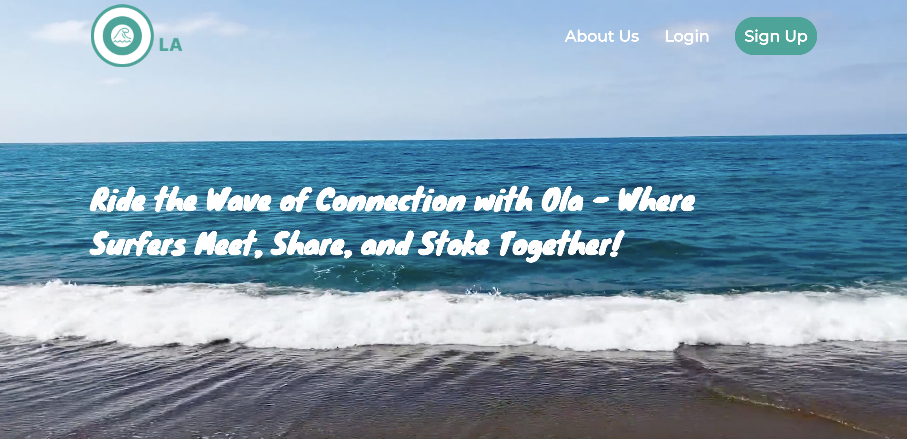
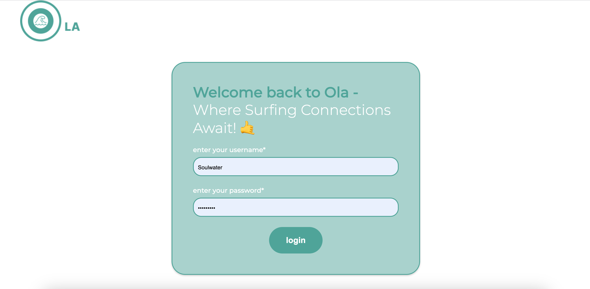
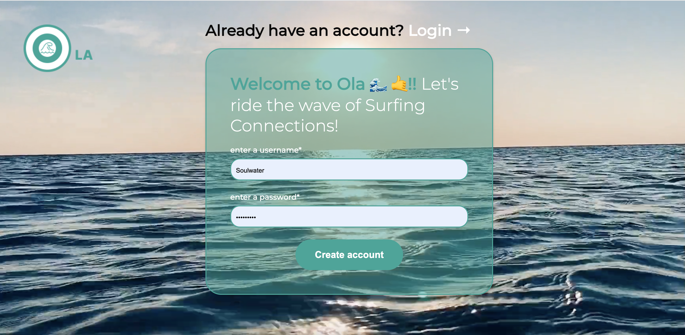
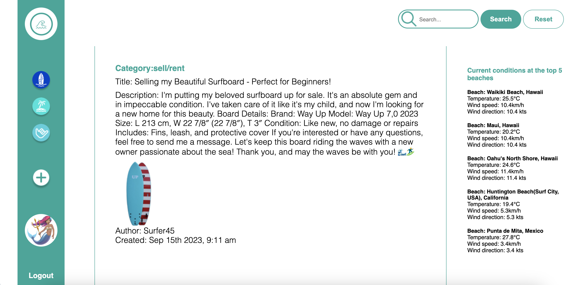
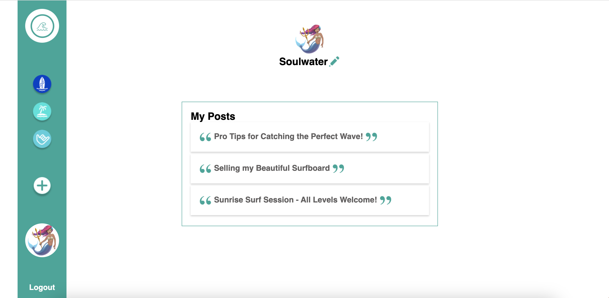
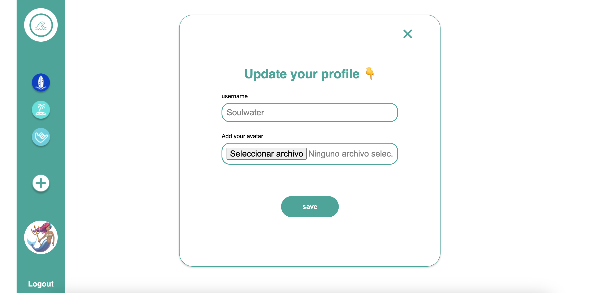
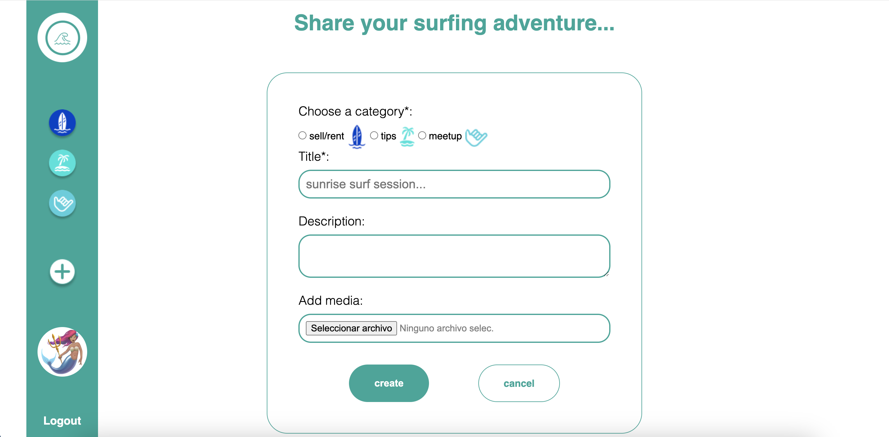
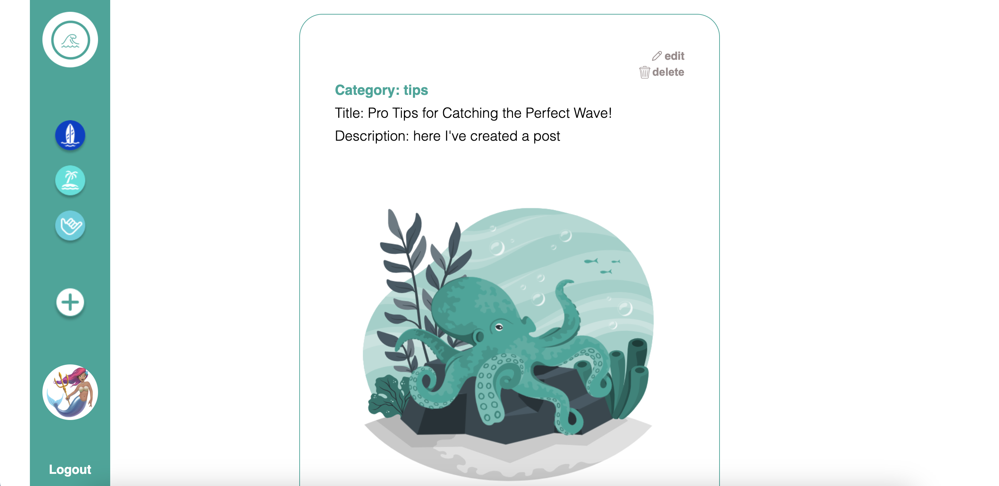
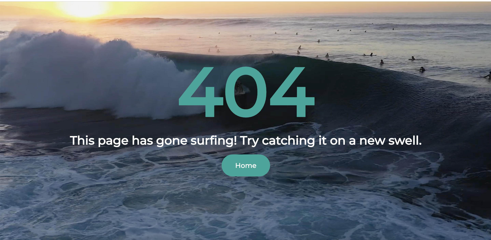

# Ola App
#Link: https://olas1.adaptable.app

## Table of Contents

- [Ola App](#ola-app)
  - [Table of Contents](#table-of-contents)
  - [Introduction](#introduction)
  - [Features](#features)
  - [Screenshots](#screenshots)
  - [Getting Started](#getting-started)
    - [Prerequisites](#prerequisites)
    - [Installation](#installation)

## Introduction

Ola App is a vibrant social platform designed exclusively for surfers. It offers a community-driven space where surfers of all levels can connect, share experiences, and stay updated on the
 latest trends in the world of surfing. This web application is built using Express.js, Handlebars, CSS, JavaScript and Mongoose, with additional features like third-party API integration and Cloudinary for seamless media handling.

## Features

- **Landing Page with Immersive Video:** The landing page welcomes users with the mesmerizing sight and sound of ocean waves. The navigation bar provides easy access to essential 
sections: "About Us," "Login," and "Signup."

- **Informative Carousel:** An interactive carousel introduces users to various post categories. While previewing is available to all, full access is exclusively granted to registered users.

- **User Registration and Authentication:** Ola App ensures a secure environment by requiring user registration and authentication to unlock its full potential. Routes are protected with 
middleware to validate user sessions.

- **User Profile Management:** Once logged in, users gain access to their profiles via a vertical navbar. They can personalize their profiles by updating avatars, names, and adding bios.

- **Comprehensive Post Management:** Users can create, read, update, and delete posts. Explore posts from other users, engage in discussions, and contribute to the vibrant surf 
community.

- **Category Filters:** A user-friendly filtering mechanism allows surfers to browse posts by categories, making it easy to find content that aligns with their interests.

- **Integration with Third-Party API:** We've thoughtfully integrated a third-party API tailored specifically for surfers. It provides valuable information to enhance the surfing experience.

- **Cloudinary Integration:** Ola App seamlessly handles image and avatar uploads using the Cloudinary service.

## Screenshots

## Getting Started

### Prerequisites

Before you get started, make sure you have the following:

- [Node.js](https://nodejs.org/) installed on your machine.
- Mongoose DB

### Installation

1. **Clone this repository:**

git clone https://github.com/yourusername/ola-app.git

Install the dependencies:

* npm install

Set up your environment variables. You'll need to configure Cloudinary credentials and any other environment variables used in your app

Start the server: npm start

Open your web browser and navigate to http://localhost:3000 to access Ola App locally.

About Us
At Ola App, we are passionate about surfing and fostering a welcoming community for surfers of all levels. Our platform is designed to connect surfers, share experiences, and make your surfing journey ev
